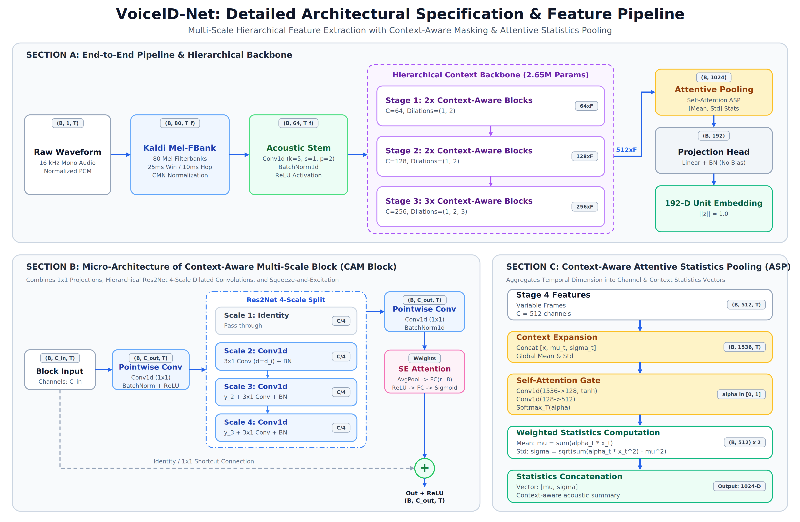

# VoiceID-Net: High-Performance Speaker Verification & Recognition Engine

[](https://www.python.org/)
[](https://pytorch.org/)
[](https://onnxruntime.ai/)
[](LICENSE)

VoiceID-Net is an ultra-low latency, high-accuracy acoustic representation model for speaker verification and recognition. Designed specifically for production deployment, it combines multi-scale context-aware residual blocks with Attentive Statistics Pooling (ASP) to output 192-dimensional speaker embeddings.

---

## Performance Benchmarks

| Metric | Measured Value | Note |
| :--- | :--- | :--- |
| **GPU Latency (RTX 4090)** | **4.56 ms** | Per 3.0s audio utterance |
| **CPU Latency (4 Threads)** | **12.43 ms** | Optimized PyTorch execution |
| **ONNX Runtime (CPU)** | **3.46 ms - 4.68 ms** | Standalone inference without PyTorch |
| **Model Parameters** | **2.65 M** | Compact and memory-efficient |
| **Embedding Dimension** | **192** | Unit hypersphere normalized |
| **Training Speed** | **~40 batches / sec** | Powered by FP16 Automatic Mixed Precision |

---

## Architecture



### Key Architectural Components

1. **Acoustic Frontend:** 80-channel log-Mel Filterbank with 25ms window, 10ms frame shift, and Cepstral Mean Normalization (CMN).
2. **Acoustic Stem:** 1D convolution with kernel size 5, stride 1, Batch Normalization, and ReLU activation.
3. **Hierarchical Multi-Scale Backbone:** 4 sequential stages of Context-Aware Blocks utilizing Res2Net multi-scale hierarchical sub-branches (dilations 1, 2, 3) coupled with Squeeze-and-Excitation channel attention.
4. **Attentive Statistics Pooling (ASP):** Calculates channel- and context-dependent attention weights to derive weighted mean and weighted standard deviation vectors.
5. **Projection & Normalization:** Linear projection to 192 dimensions followed by Batch Normalization and L2 unit hypersphere normalization.

---

## Quick Start

### 1. Installation
```bash
python3 -m venv .venv
source .venv/bin/activate
pip install -r requirements.txt
```

### 2. Verify Architecture and Latency
```bash
python -m voice_engine.main test-arch
```

### 3. Run Autonomous Training
```bash
python train.py --epochs 20 --batch-size 16
```
Training will automatically:
- Train the model using Automatic Mixed Precision (AMP) on GPU.
- Save best weights to `checkpoints/voiceid_best.pt`.
- Export production ONNX to `voice_engine/voice_encoder.onnx`.
- Generate and save training loss curves (`checkpoints/training_loss_curves.png`) and speaker separation distributions (`checkpoints/speaker_separation_curve.png`).

---

## Production Inference and Verification

```python
from voice_engine.infer import VoiceVerifier

verifier = VoiceVerifier("voice_engine/voice_encoder.onnx")

# Extract 192-dim speaker vector
emb = verifier.get_embedding("sample.wav")

# Verify two speakers (returns cosine similarity and boolean match)
similarity, is_same = verifier.verify("audio1.wav", "audio2.wav", threshold=0.60)
print(f"Cosine Similarity: {similarity:.4f} | Same Speaker: {is_same}")
```

---

## Project Structure

```text
├── assets/
│   └── voiceid_architecture.png      # Publication architecture diagram
├── checkpoints/
│   ├── training_loss_curves.png      # Training loss history plot
│   ├── speaker_separation_curve.png  # Speaker score separation plot
│   ├── voiceid_best.pt               # Best PyTorch model checkpoint
│   └── voiceid_latest.pt             # Latest PyTorch model checkpoint
├── data/
│   └── embeddings_cache.pt           # Pre-cached reference embeddings
├── voice_engine/
│   ├── models.py                     # 2.65M VoiceIDNet architecture
│   ├── features.py                   # 80-dim log-Mel FBank + SpecAugment
│   ├── losses.py                     # Multi-Tier Metric Loss Engine
│   ├── dataset.py                    # SpeechDataset loader & batch collator
│   ├── trainer.py                    # Self-contained AMP trainer
│   ├── plots.py                      # Matplotlib visualization engine
│   ├── export_onnx.py                # Production ONNX exporter
│   ├── infer.py                      # Standalone verification client
│   └── voice_encoder.onnx            # Production ONNX model
├── requirements.txt                  # Dependency specifications
├── train.py                          # Training command center
└── README.md
```

---

## License
Apache License 2.0
